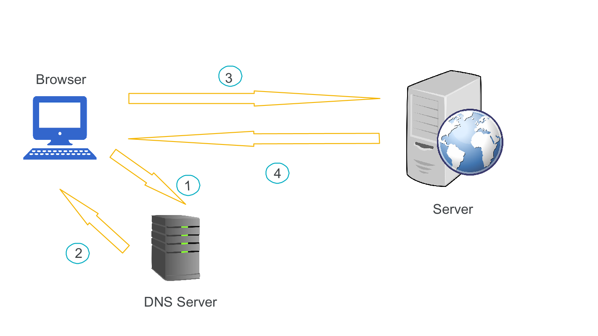
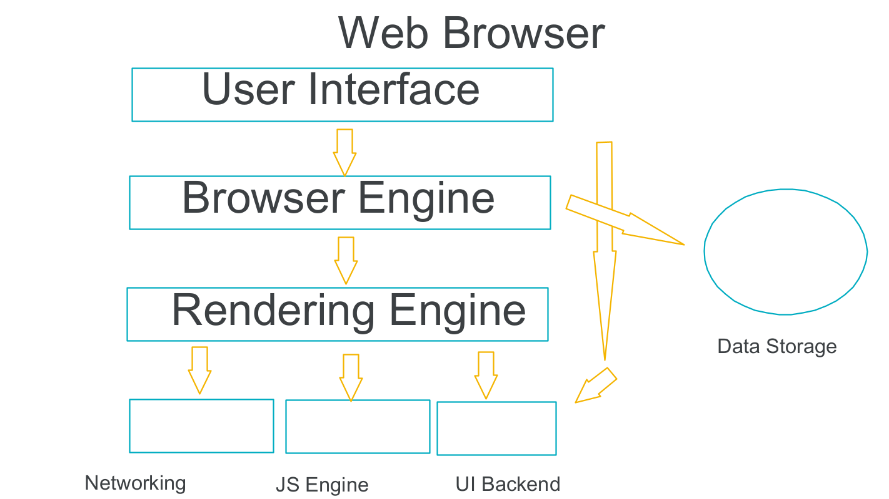

# When a user enters an URL in the browser, how does the browser fetch the desired result ?

Just like a mail receiving to your address , internet is having it's own way to send and recieve data . Just like your address ,resources in internet is also having thier own address.  

When u enter the website url in the browser these are the steps happening behind
1. Find the location in which the website is hosted
2. Make request to ther server to get the required data
3. Send request to get specific page
4. Handle response send by the server 
5. Render whatever the content send by server in to the browser

Let's discuss each step

## 1. Find the location in which the website is hosted
All the resources connect to internet is having it's own address . When we enter a url in the browser we are actually searching for a machine in which all the files realted to the website is stored. for example the address of the machine will br 12.12.12.12 , this i hard to remember and there are lacks of websites in the world. To solve this issue we are using urls. DNS is the one who help us in this citauion .DNS stands for Domain Name System, is like a directory contaning all the urls and it's ips. DNS will drive us to the correct ip address . 

## 2. Make request to ther server to get the required data
Now we know where is the data is located . In this step we ask the server about our requirement . Server will check for the data inside thier machine and send to our machine
## 3.  Send request to get specific page
 This step is similar to the 2 but, here we are checking specific source inside a server like a /about page of a website, Server will check for the page and send us the data, if the data is not there it will send us a not found error
## 4. Handle response send by the server 
In this case all the data send from the server will reach to our machine . This will include html, css, js, svg, and image files . Now we actually need to parse the data and combine it and show in a meaningful way. All these steps are handled by our browser.Browser have seperate parsers for handling this
## 5. Render whatever the content send by server in to the browser
Render is the time were we see the content in a browser . for parsing HTML,CSS and JS. there are parser and interpreters . These tools parse the data and show in browser . 

## Handling data transit and data rendering

### Data Transit

Here i have simplified the data transit to 4 parts
1. Sending the Url to DNS server to identify the ip
2. DNS server sending the ip address
3. Browser sending this ip to identify the hosted sever and asking for the data
4. Server sending the required data like HTML,CSS, JS and images 

### Data rendering

There are basically two step for this Parsing and Rendering
Parsing is the step where HTML,CSS,JS is parsing to the required way
Rendering is the step where the parsed datas are convering to DOM tree and it's layouts

1. The rendering engine starts getting the contents of the requested document from the networking layer. 
2. A DOM tree is built out of the broken response.
3. New requests are made to the server for each new resource that is found in the HTML source (typically images, style sheets, and JavaScript files).
4. At this stage the browser marks the document as interactive and starts parsing scripts that are in "deferred" mode: those that should be executed after the document is parsed. The document state is set to "complete" and a "load" event is fired.
5. Each CSS file is parsed into a StyleSheet object, where each object contains CSS rules with selectors and objects corresponding to CSS grammar. The tree built is called CSSCOM.
6. On top of DOM and CSSOM, a rendering tree is created, which is a set of objects to be rendered. Each of the rendering objects contains its corresponding DOM object (or a text block) plus the calculated styles. In other words, the render tree describes the visual representation of a DOM.
7. After the construction of the render tree it goes through a "layout" process. Which means giving each node the exact coordinates where it should appear on the screen.
8. The next stage is painting–the render tree will be traversed and each node will be painted using the UI backend layer.
9. Repaint: When changing element styles that don't affect the element's position on a page (such as background-color, border-color, visibility), the browser just repaints the element again with the new styles applied (that means a "repaint" or "restyle" is happening).
10. Reflow: When the changes affect document contents or structure, or element position, a reflow (or relayout) happens.

## Other topics
These are so many points , we have to dicuss , something like security, protocols, SSL, server side rendering and client side rendering 
 

 

## Reference
1. https://aws.amazon.com/blogs/mobile/what-happens-when-you-type-a-url-into-your-browser/

2.  https://dev.to/shwetabh1/complete-webpage-rendering-process-in-browser-59l1