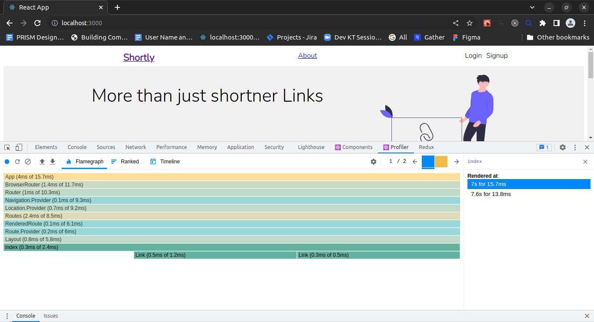
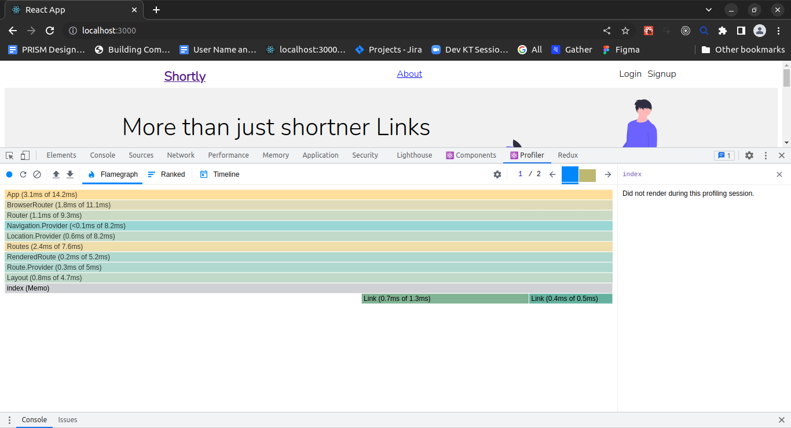

# URL shortner app

## Available Scripts

In the project directory, you can run:

### `npm start`

Runs the app in the development mode.\
Open [http://localhost:3000](http://localhost:3000) to view it in your browser.

The page will reload when you make changes.\
You may also see any lint errors in the console.

### `npm test`

Launches the test runner in the interactive watch mode.\
See the section about [running tests](https://facebook.github.io/create-react-app/docs/running-tests) for more information.

### `npm run build`

Builds the app for production to the `build` folder.\
It correctly bundles React in production mode and optimizes the build for the best performance.

The build is minified and the filenames include the hashes.\
Your app is ready to be deployed!

## Deploy

For app deployment  

1. Build app
   run `npm run build` to build the app
2. You will get a folder named build which will contain al the build files
3. Use this link to [https://app.netlify.com/drop](https://app.netlify.com/drop) to upload build folder
4. You will get the public netlify link

## Bench marking

This screenshot shows the render time before optimisation

This screenshot shows the render time after optimisation

index component is momised (header and footer)
Used memoisation to memoise the header and footer

# public url

[link](https://dulcet-strudel-3c7e77.netlify.app/)
